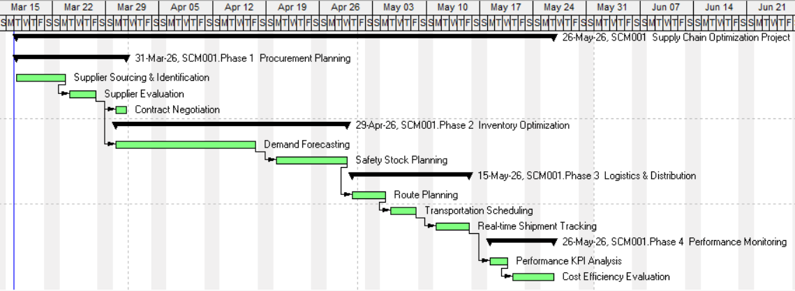
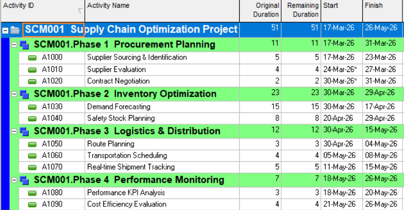

# 🚀 Supply Chain Optimization Project

## 📌 Overview

This project simulates a real-world supply chain optimization scenario, focusing on improving procurement planning, task execution, and operational efficiency.

Using structured tools like Gantt Chart and Work Breakdown Structure (WBS), the project highlights process dependencies, identifies potential delays, and improves coordination across different stages of the supply chain.

📍 Use Case: Applicable to manufacturing and FMCG supply chain operations

---

## 📊 Project Components

### 📅 Gantt Chart (Project Timeline)

➡️ This Gantt chart visualizes the complete supply chain workflow from procurement planning to performance monitoring, highlighting task dependencies, execution flow, and timeline efficiency. Developed using Oracle Primavera for structured project scheduling.

---

### 🧩 Work Breakdown Structure (WBS)

➡️ This Work Breakdown Structure (WBS) divides the project into structured phases and tasks, enabling better planning, coordination, and execution control across supply chain activities.

---

## 🎯 Objectives

* Improve supply chain planning and visibility
* Reduce operational delays across stages
* Ensure structured and efficient execution

---

## 🔍 Key Insights

* Structured planning significantly improves execution efficiency
* Clear task breakdown reduces operational confusion
* Visualization tools enhance decision-making and tracking
* End-to-end visibility helps identify process bottlenecks

---

## 💼 Business Impact

* Improved coordination between procurement, inventory, and logistics
* Better visibility across supply chain stages
* Reduced delays through structured planning
* Enhanced ability to identify and manage bottlenecks

---

## ⚙️ Tools & Concepts Used

* Oracle Primavera (Project Scheduling & Planning)
* Gantt Chart (Project Timeline Visualization)
* Work Breakdown Structure (WBS)
* Supply Chain Planning Concepts
* Process Visualization

---

## 👤 Author

Sanket Chauhan
